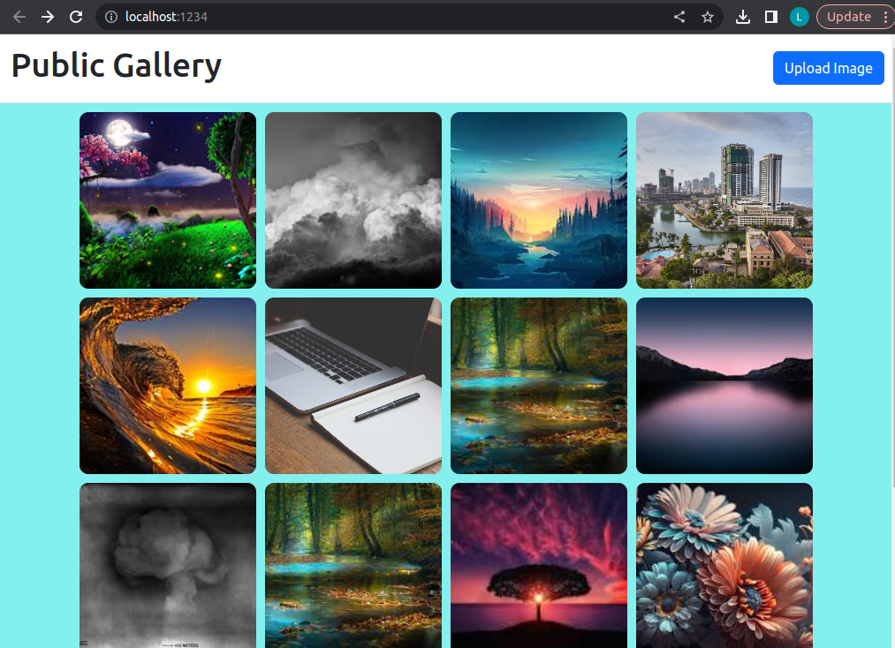

# Image Gallery Web Application

This is a simple image gallery web application built using Spring for the backend and HTML, CSS, and JavaScript for the frontend.

## Description

This web application allows users to view a gallery of images, upload new images, and download individual images. It is a basic example of how to create an image gallery with Spring and front-end technologies.

## Features

- View a gallery of images.
- Upload images to the gallery.
- Download individual images.

## Technologies

- **Backend:** 
- **Frontend:**   
- **Frontend Framework:** 

This project is licensed under the MIT License .